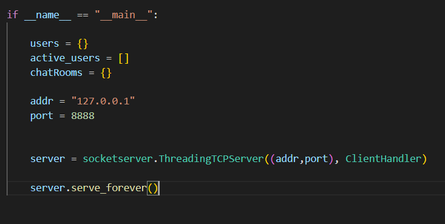
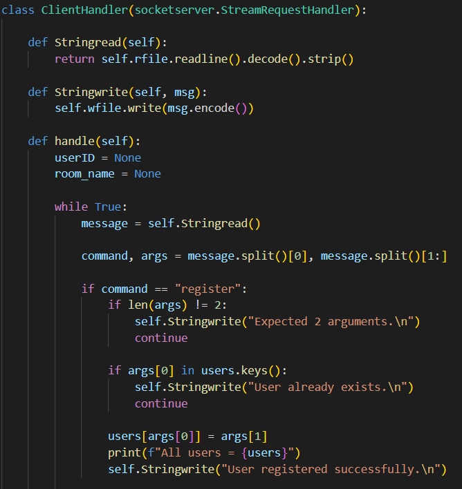
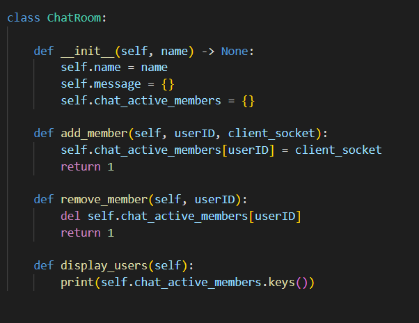
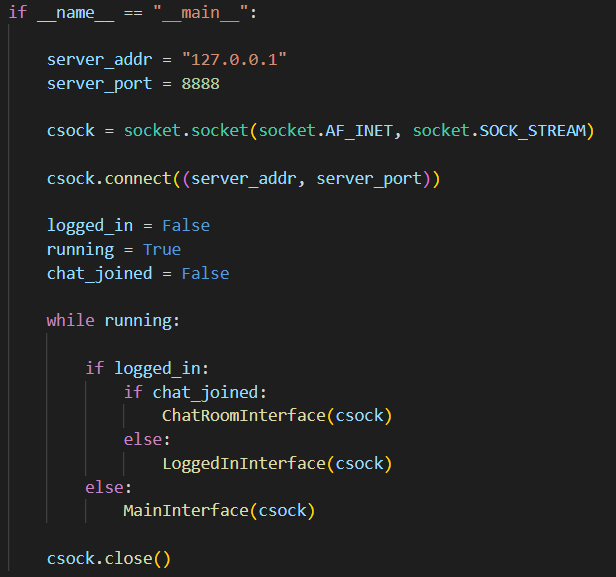
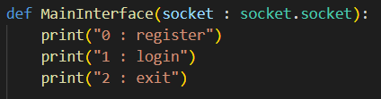
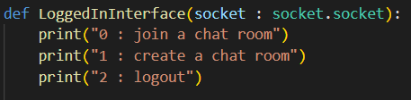
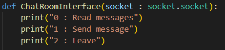
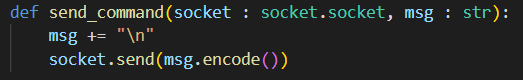

# Chat Application Documentation
### By Prakhar Saxena 2020CSB1111

This is a chat application built using Python programming language that allows multiple users to join chat rooms and communicate with each other. The application has two parts, the server and the client.

The server listens for incoming client connections and is responsible for handling all the communication between clients. The client connects to the server and sends commands to perform various actions such as registering a new user, logging in, creating a chat room, joining a chat room, sending messages, and leaving a chat room.

## How to Run Application

- Run `python server.py`
- In another terminal, run `python client.py` to run the client.
- Follow the menu-driven program in client to proceed.

## Server

### Main function

-   `Main function`: It starts the server.
-   `users = {}`: This variable is a dictionary that stores the registered users and their passwords.
-   `active_users = []`: This variable is a list that stores the IDs of the currently active users.
-   `chatRooms = {}`: This variable is a dictionary that stores the chat rooms and their active members.
-   `server = socketserver.ThreadingTCPServer((addr,port), ClientHandler)`: This line creates a new instance of the `ThreadingTCPServer` class and starts listening for incoming client connections.
-   `server.serve_forever()`: This line starts the server and puts it in an infinite loop to keep it running indefinitely.

### `ClientHandler` class

Note - Only the register command is shown in code snippet. All other commands listed below are handled in a similar manner.

This class is called as a target of `socketserver.ThreadingTCPServer`. It starts a new thread for each client connection.

ClientHandler inherits the `sockerserver.StreamRequestHandler` base class which implements `readline()` and `write()` methods by converting socket into file stream.

-   `Stringread()`: This method reads a string from the input stream.
-   `Stringwrite(msg)`: This method writes a string to the output stream.
-   `handle()`: This method handles incoming client connections and processes their commands. It contains an infinite loop that listens for incoming messages from the client and then processes them based on the command type. All commands are discussed below.

### `ChatRoom` class

-   `__init__(name)`: This method initializes the chat room with a given name and an empty list of active members.
-   `add_member(userID, client_socket)`: This method adds a new member to the chat room.
-   `remove_member(userID)`: This method removes a member from the chat room.
-   `display_users()`: This method displays the list of active members in the chat room.

## Commands
The program is menu-driven. But under-the-hood, commands are sent to the server by the client.
The system is designed such that all communication between the `client` and `server` takes place using commands. Following are the commands which the `client` sends and `server` processes. 
All checks of already existing and invalidity are done as well.

#### Main Interface
- `register <UID> <PASSWORD>` - Registers the user with given password.
- `login <UID> <PASSWORD>` - Logs the user in with the given password, proceeds to the `LoggedInInterface`.
- `exit` - Exits and shuts down the client.
#### Logged-In Interface
- `join <CHAT-ID>` - Joins the chat room with given ID / name, moves to `ChatRoomInterface`.
- `create <CHAT-ID>` - Creates a chat room with given ID / name and joins it.
- `logout` - Logs the user out back to the `MainInterface`
#### Chat Room Interface
- `send <message>` - Send the message from the user to all active users in the chat room.

## Client

### Main function

-  It creates a socket object and connects to the server. If the connection is successful, it displays a login menu and prompts the user to enter the option according to the below interfaces.

### `Main Interface`

- `MainInterface(socket: socket.socket)`:  This function takes a socket object as input and provides an interface for the user to interact with the application when the application starts. It displays a menu of options that the user can choose from and then sends the corresponding command to the server.
- 1. Register - Method which is called when new user registers.
- 2. Login - Method which is called for user to login
- 3. Exit - Exit the application. Client disconnects from the server and shuts down.

### `LoggedInInterface` 

-   `LoggedInInterface(socket: socket.socket)`: This function takes a socket object as input and provides an interface for the user to interact with the application after logging in. It displays a menu of options that the user can choose from and then sends the corresponding command to the server.
- 1. Join a chat room - Given a room name, join the chat room.
- 2. Create a chat room - Creates a new chat room with given input and joins it.
- 3. Logout - Method to logout

### `ChatRoomInterface`
 

-   `ChatRoomInterface(socket: socket.socket)`: This function takes a socket object as input and provides an interface for the user to interact with the chat room. It displays a menu of options that the user can choose from and then sends the corresponding command to the server.
- 1. Read messages - The mode in which the user will read all inputs
- 2. Send message - The mode in which the user will be able to send message to the server to be sent to all users joined in the chat room.
- 3. Leave - To leave the chatroom.

### `send_command` function

-   `send_command(socket: socket.socket, command: str)`: This function takes a socket object and a command string as input and sends the command to the server.
- It adds a trailing `\n` to the command before sending so that the server can use `readline()` to read the command.
